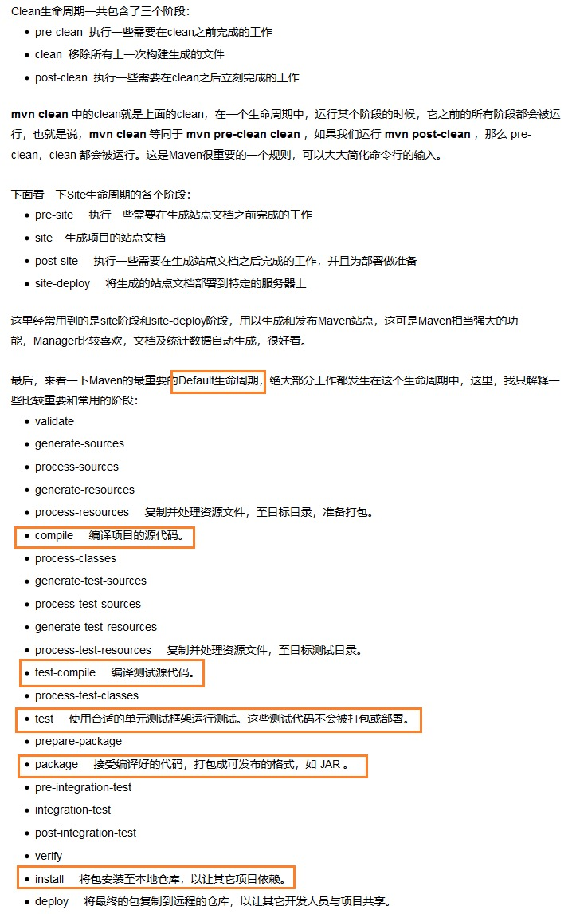

## Maven概念

是一个基于Java平台的 自动化构建工具
	(make-ant-maven-gradle)

## maven的作用

- 增加第三方Jar   (commons-fileupload.jar   commons-io.jar)
  - jar包之间的依赖关系 （commons-fileupload.jar 自动关联下载所有依赖的Jar，并且不会冲突）
- 将项目拆分成若干个模块

## maven的动作

清理：删除编译的结果，为重新编译做准备。
编译：java->class
测试：针对于 项目中的关键点进行测试，亦可用 项目中的测试代码 去测试开发代码；
报告：将测试的结果 进行显示
打包： 将项目中包含的多个文件 压缩成一个文件， 用于安装或部署。 （java项目-jar、web项目-war）
安装：将打成的包  放到  本地仓库，供其他项目使用。
部署：将打成的包  放到  服务器上准备运行。
	--将java、js、jsp等各个文件 进行筛选、组装，变成一个 可以直接运行的项目
	-- 大米->米饭


	-Eclipse中部署的web项目可以运行
	-将Eclipse中的项目，复制到tomcat/webapps中则不能运行
	-项目可以在webappas中直接运行
	
	Eclipse中的项目 ，在部署时 会生成一个 对应的 部署项目(在wtpwebapps中)，区别在于： 部署项目 没有源码文件src(java)，只有编译后的class文件和jsp文件
	因为二者目录结构不一致，因此tomcat中无法直接运行 Eclips中复制过来的项目 （因为 如果要在tomcat中运行一个项目，则该项目 必须严格遵循tomcat的目录结构）
	
	Eclipse中的项目 要在tomcat中运行，就需要部署： a.通过Eclipse中Add and Remove按钮进行部署
						      b.将Web项目打成一个war包，然后将该war包复制到tomcat/webapps中 即可执行运行


 自动化构建工具maven：将 原材料（java、js、css、html、图片）->产品（可发布项目）


 编译-打包-部署-测试   --> 自动构建

## 下载配置maven

配置JAVA_HOME

配置MAVEN_HOME    :    D:\apache-maven-3.5.3\bin
	M2_HOME
配置path
	%MAVEN_HOME%\bin	
验证
        mvn -v
配置本地仓库  maven目录/conf/settings.xml
 - 默认本地仓库 ：C:/Users/YANQUN/.m2/repository
 - 修改本地仓库：  <localRepository>D:/mvnrep</localRepository>

## 使用maven

约定 优于 配置 

	硬编码方式：job.setPath("d:\\abc") ;
	配置方式：
		job
	conf.xml                   <path>d:\\abc</path>
	
	约定：使用默认值d:\\abc
		job

maven约定的目录结构：


	项目
		-src				
			--main			：程序功能代码
				--java		 java代码  (Hello xxx)
				--resources      资源代码、配置代码
			--test			：测试代码
				--java			
				--resources	
	  -pom.xml
	

pom.xml


```xml
<groupId>域名翻转.大项目名</groupId>
<groupId>org.lanqiao.maven</groupId>

<artifactId>子模块名</artifactId>
<artifactId>HelloWorld</artifactId>

<version>版本号</version>
<version>0.0.1-SNAPSHOT</version>
```


依赖：
commons-fileupload.jar --> commons-io.jar
A中的某些类 需要使用B中的某些类，则称为A依赖于B
在maven项目中，如果要使用 一个当时存在的Jar或模块，则可以通过 依赖实现（去本地仓库、中央仓库去寻找）

```xml
<dependencies>
  <dependency>
    <groupId>junit</groupId>
    <artifactId>junit</artifactId>
    <version>4.0</version>
    <scope>test</scope>
  </dependency>
</dependencies>
```


## 执行mvn：  必须在pom.xml所在目录中执行

maven常见命令： 第一次执行命令时，因为需要下载执行该命令的基础环境，所以会从远程仓库（伺服，中央）下载该环境到本地仓库

### 编译：  (  Maven基础组件 ，基础Jar)

``` 
mvn compile   --只编译main目录中的java文件
```

### 测试

```
mvn test 
```

### 打成jar/war

```
mvn package 
```

### 放入本地仓库

```
mvn install  将开发的模块 放入本地仓库，供其他模块使用 （放入的位置 是通过gav决定）
```

### 删除target目录

```
mvn clean  删除target目录（删除编译文件的目录）
```


## 依赖：

A jar -> B jar

```xml
<dependency>
  <groupId>junit</groupId>
  <artifactId>junit</artifactId>
  <version>4.0</version>
  <scope>test</scope>
</dependency>
```

### 依赖的范围、依赖的有效性

Maven在编译、测试、运行项目时，各自使用一套classpath

|                  | **compile** | **test** | **provided** |
| ---------------- | ----------- | -------- | ------------ |
| 编译             | √           | ×        | √            |
| 测试             | √           | √        | √            |
| **部署**（运行） | √           | ×        | ×            |

commons-fileupload.jar  commons-io.jar  :虽然我们实际开发时，认为二者jar必须关联，但是maven可能不这么认为。
 如果X.jar 依赖于Y.jar，但是在引入X.jar之前  已经存在了Y.jar，则maven不会再在 引入X.jar时 引入Y.jar

### 依赖排除
   A.jar ->B.jar
  当我们通过maven引入A.jar时，会自动引入B.jar
	A.jar(x.java ,y.java,z.java)     B.jar(p.java  c.java  i.java)
		A.jar和B.jar之间的 依赖的本质：z.java ->c.java

```xml
<!-- 排除依赖 beans -->
<exclusions>
  <exclusion>
    <groupId>org.springframework</groupId>
    <artifactId>spring-beans</artifactId>
  </exclusion>
</exclusions>
```

### 依赖的传递性

A.jar-B.jar->C.jar

要使 A.jar ->C.jar:当且仅当 B.jar 依赖于C.jar的范围是compile

## 多个maven项目（模块）之间如何 依赖： p项目 依赖于->q项目

p项目 install 到本地仓库

q项目 依赖：

```xml
<!-- 本项目  依赖于HelloWorld2项目 -->
<dependency>
  <groupId>org.lanqiao.maven</groupId>
  <artifactId>HelloWorld2</artifactId>
  <version>0.0.1-SNAPSHOT</version>
</dependency>
```

## maven 生命周期

package:
resources
compile
test
package

maven生命周期:
生命周期和构建的关系：
生命周期中的顺序：a b c d e 
当我们执行c命令，则实际执行的是 a b c 

### 生命周期的三个阶段

- clean lifecycle ：清理
  	pre-clean  clean  post-clearn

- default lifecycle ：默认(常用)	

- site lifecycle：站点
  	pre-site   site   post-site site-deploy



## 在Eclipse中创建maven工程：
1.配置maven:
配置maven版本
配置本地仓库  ：  设置settings.xml

在eclipse中编写完pom.xml依赖后，需要maven-update project

再次强调：在pom.xml中增加完依赖后 需要maven - update project


​	